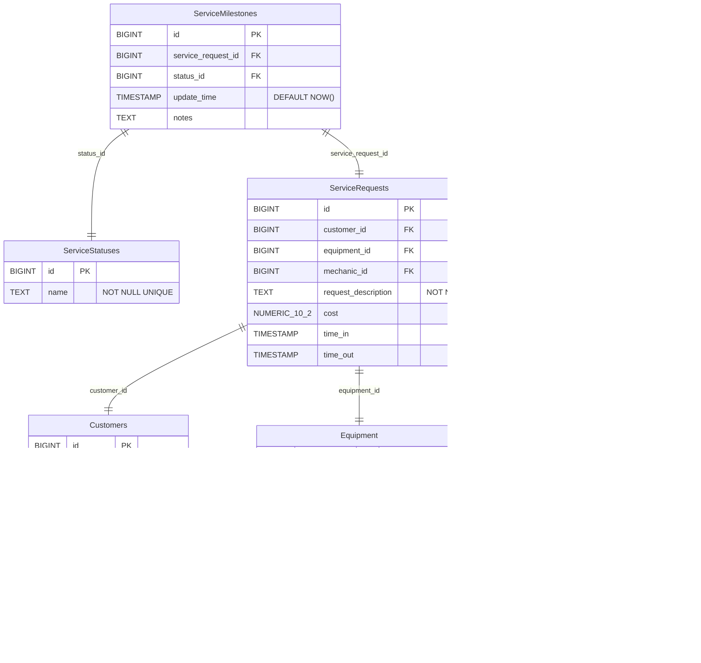

# Bike Shop sample data

This sample dataset represents a bicycle shop managing their customer service requests.

```mermaid
%% https://mermaid.js.org/syntax/entityRelationshipDiagram.html

erDiagram
    Customers {
        BIGINT id PK
        TEXT first_name "NOT NULL"
        TEXT last_name "NOT NULL"
        TEXT email
        TEXT phone
    }
    EquipmentTypes {
        BIGINT id PK
        TEXT name "NOT NULL"
    }
    Equipment {
        BIGINT id PK
        TEXT serial_number "NOT NULL UNIQUE"
        TEXT notes
        BIGINT type_id FK
    }
    Mechanics {
        BIGINT id PK
        TEXT first_name "NOT NULL"
        TEXT last_name "NOT NULL"
    }
    ServiceStatuses {
        BIGINT id PK
        TEXT name "NOT NULL UNIQUE"
    }
    ServiceRequests {
        BIGINT id PK
        BIGINT customer_id FK
        BIGINT equipment_id FK
        BIGINT mechanic_id FK
        TEXT request_description "NOT NULL"
        NUMERIC_10_2 cost
        TIMESTAMP time_in
        TIMESTAMP time_out
    }
    ServiceMilestones {
        BIGINT id PK
        BIGINT service_request_id FK
        BIGINT status_id FK
        TIMESTAMP update_time "DEFAULT NOW()"
        TEXT notes
    }

    Equipment ||--|| EquipmentTypes : "type_id"
    ServiceRequests ||--|| Customers : "customer_id"
    ServiceRequests ||--|| Equipment : "equipment_id"
    ServiceRequests ||--|| Mechanics : "mechanic_id"
    ServiceMilestones ||--|| ServiceRequests : "service_request_id"
    ServiceMilestones ||--|| ServiceStatuses : "status_id"

```
