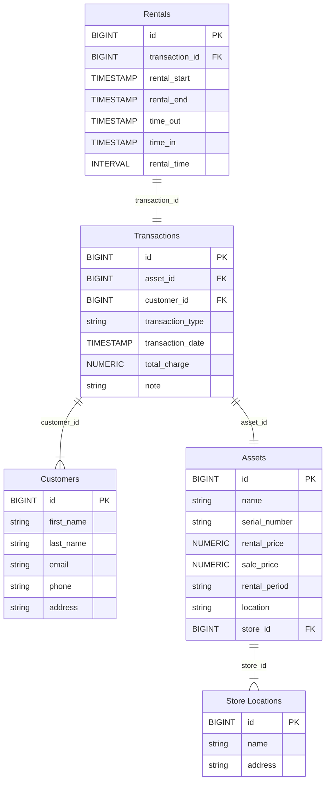

# Hardware Store sample data

This sample dataset represents a chain of hardware stores managing their inventory and rentals.

```mermaid
%% https://mermaid.js.org/syntax/entityRelationshipDiagram.html

erDiagram
    "Store Locations" {
        BIGINT id PK
        string name
        string address
    }

    "Customers" {
        BIGINT id PK
        string first_name
        string last_name
        string email
        string phone
        string address
    }

    "Assets" {
        BIGINT id PK
        string name
        string serial_number
        NUMERIC rental_price
        NUMERIC sale_price
        string rental_period
        string location
        BIGINT store_id FK
    }

    "Transactions" {
        BIGINT id PK
        BIGINT asset_id FK
        BIGINT customer_id FK
        string transaction_type
        TIMESTAMP transaction_date
        NUMERIC total_charge
        string note
    }

    "Rentals" {
        BIGINT id PK
        BIGINT transaction_id FK
        TIMESTAMP rental_start
        TIMESTAMP rental_end
        TIMESTAMP time_out
        TIMESTAMP time_in
        INTERVAL rental_time
    }

%% Relationships
%%  See: https://mermaid.js.org/syntax/entityRelationshipDiagram.html#relationship-syntax
    "Assets" ||--|{ "Store Locations" : "store_id"
    "Transactions" ||--|| "Assets" : "asset_id"
    "Transactions" ||--|{ "Customers" : "customer_id"
    "Rentals" ||--|| "Transactions" : "transaction_id"
```
