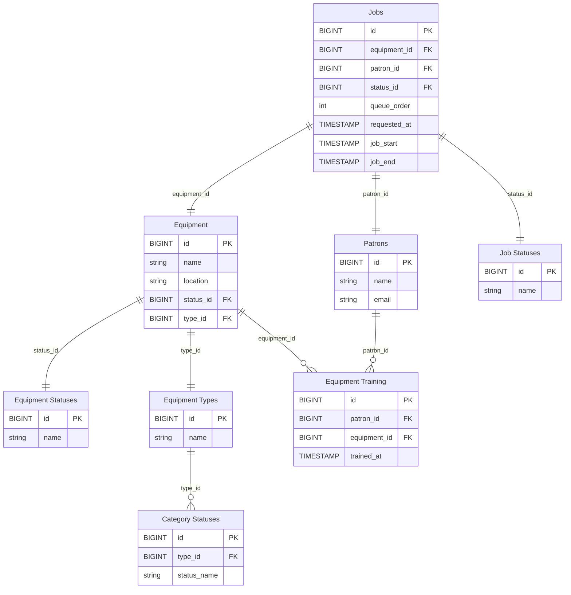

Library Makerspace Sample Data

This sample dataset represents a library makerspace managing equipment, patrons, and job requests with enforced training requirements for patrons.

```mermaid
%% https://mermaid.js.org/syntax/entityRelationshipDiagram.html

erDiagram
    "Equipment" {
        BIGINT id PK
        string name
        string location
        BIGINT status_id FK
        BIGINT type_id FK
    }

    "Patrons" {
        BIGINT id PK
        string name
        string email
    }

    "Jobs" {
        BIGINT id PK
        BIGINT equipment_id FK
        BIGINT patron_id FK
        BIGINT status_id FK
        int queue_order
        TIMESTAMP requested_at
        TIMESTAMP job_start
        TIMESTAMP job_end
    }

    "Equipment Statuses" {
        BIGINT id PK
        string name
    }

    "Job Statuses" {
        BIGINT id PK
        string name
    }

    "Equipment Types" {
        BIGINT id PK
        string name
    }

    "Category Statuses" {
        BIGINT id PK
        BIGINT type_id FK
        string status_name
    }

    "Equipment Training" {
        BIGINT id PK
        BIGINT patron_id FK
        BIGINT equipment_id FK
        TIMESTAMP trained_at
    }

%% Relationships
%%  See: https://mermaid.js.org/syntax/entityRelationshipDiagram.html#relationship-syntax
    "Equipment" ||--|| "Equipment Statuses" : "status_id"
    "Equipment" ||--|| "Equipment Types" : "type_id"
    "Equipment" ||--o{ "Equipment Training" : "equipment_id"
    "Equipment Types" ||--o{ "Category Statuses" : "type_id"
    "Patrons" ||--o{ "Equipment Training" : "patron_id"
    "Jobs" ||--|| "Equipment" : "equipment_id"
    "Jobs" ||--|| "Patrons" : "patron_id"
    "Jobs" ||--|| "Job Statuses" : "status_id"
```
