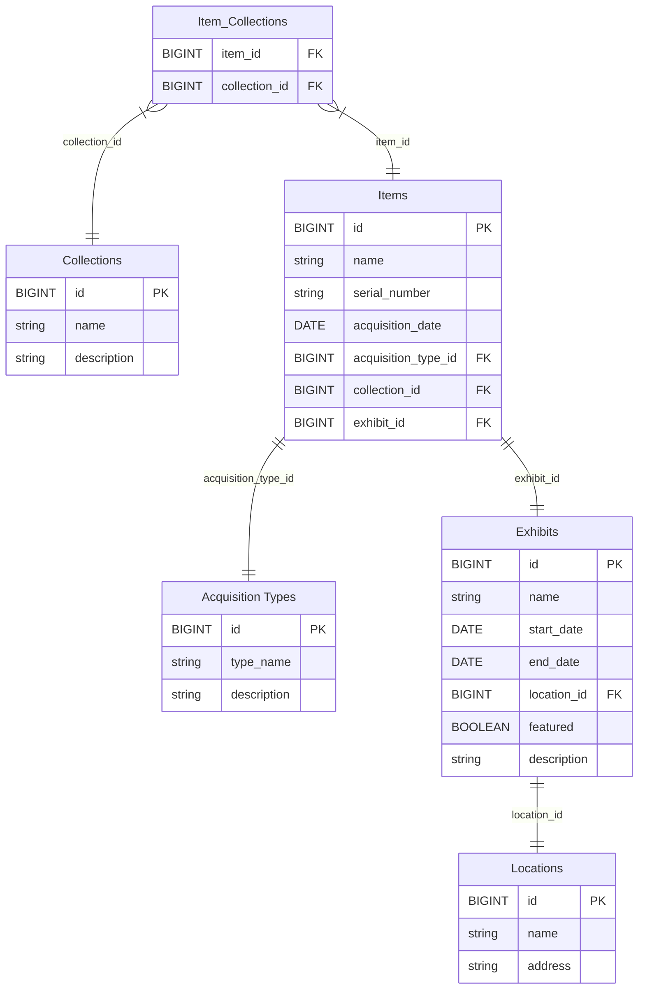

# Museum Exhabits sample data

This sample dataset represents a museum managing their assets and exhibits across multiple locations.

```mermaid
%% https://mermaid.js.org/syntax/entityRelationshipDiagram.html

erDiagram
    "Acquisition Types" {
        BIGINT id PK
        string type_name
        string description
    }

    "Collections" {
        BIGINT id PK
        string name
        string description
    }

    "Locations" {
        BIGINT id PK
        string name
        string address
    }

    "Exhibits" {
        BIGINT id PK
        string name
        DATE start_date
        DATE end_date
        BIGINT location_id FK
        BOOLEAN featured
        string description
    }

    "Items" {
        BIGINT id PK
        string name
        string serial_number
        DATE acquisition_date
        BIGINT acquisition_type_id FK
        BIGINT collection_id FK
        BIGINT exhibit_id FK
    }

    "Item_Collections" {
        BIGINT item_id FK
        BIGINT collection_id FK
    }

%% Relationships
%%  See: https://mermaid.js.org/syntax/entityRelationshipDiagram.html#relationship-syntax
    "Exhibits" ||--|| "Locations" : "location_id"
    "Items" ||--|| "Acquisition Types" : "acquisition_type_id"
    "Items" ||--|| "Exhibits" : "exhibit_id"
    "Item_Collections" }|--|| "Items" : "item_id"
    "Item_Collections" }|--|| "Collections" : "collection_id"

```
