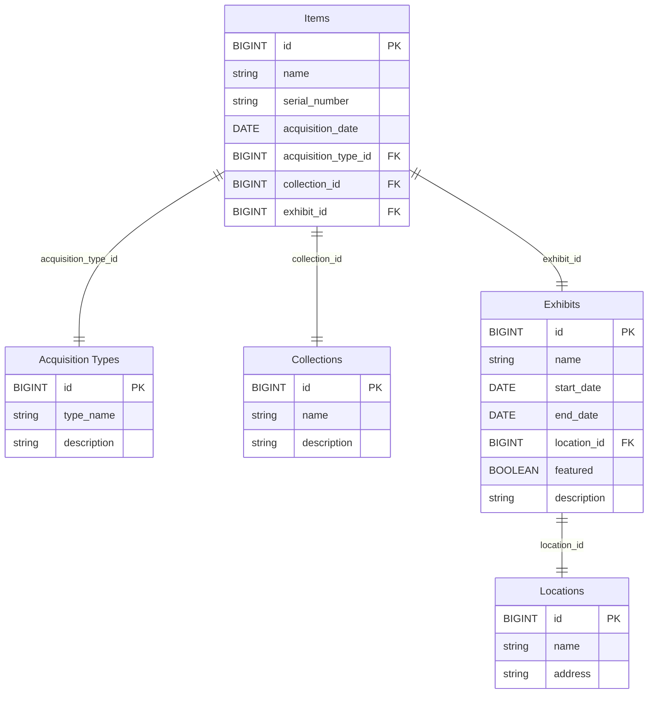

# Museum Exhabits sample data

This sample dataset represents a museum managing their assets and exhibits across multiple locations.




## Loading Data

The generated SQL file, `generate_data/load_data.sql`, contains all the necessary COPY commands to import data into your database. The data (and the load data file) are produced by the `generate_data.py` file, which can be adjusted and re-run to alter the data if needed.

Load the data into a locally-running Mathesar instance like this:

```shell
# First load the schema and tables
docker exec -i mathesar_dev_db bash -c 'psql -U mathesar' < schema.sql
# Then the sample data
docker exec -i mathesar_dev_db bash -c 'psql -U mathesar' < generated_data.sql
```

## Development

The only requirement is to install dependencies with `pip install -r requirements.txt`.
