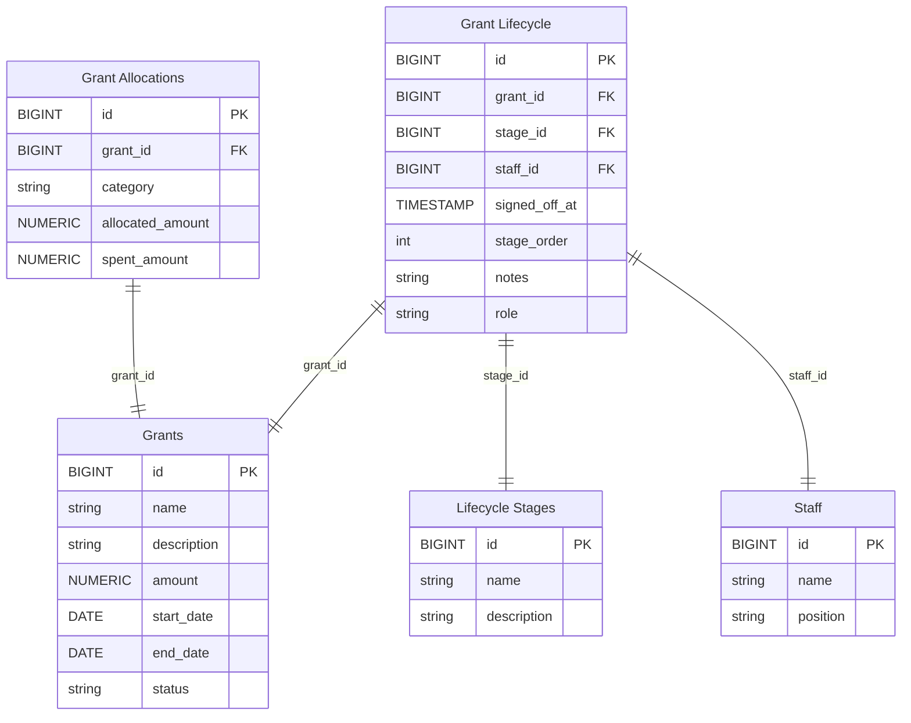

# Nonprofit Grant Tracking Sample Data

This sample dataset represents a nonprofit organization tracking grants, their lifecycle stages, staff involvement, and fund allocations.

```mermaid
%% https://mermaid.js.org/syntax/entityRelationshipDiagram.html

erDiagram
    "Grants" {
        BIGINT id PK
        string name
        string description
        NUMERIC amount
        DATE start_date
        DATE end_date
        string status
    }

    "Staff" {
        BIGINT id PK
        string name
        string position
    }

    "Lifecycle Stages" {
        BIGINT id PK
        string name
        string description
    }

    "Grant Lifecycle" {
        BIGINT id PK
        BIGINT grant_id FK
        BIGINT stage_id FK
        BIGINT staff_id FK
        TIMESTAMP signed_off_at
        int stage_order
        string notes
        string role
    }

    "Grant Allocations" {
        BIGINT id PK
        BIGINT grant_id FK
        string category
        NUMERIC allocated_amount
        NUMERIC spent_amount
    }

%% Relationships
%%  See: https://mermaid.js.org/syntax/entityRelationshipDiagram.html#relationship-syntax
    "Grant Lifecycle" ||--|| "Grants" : "grant_id"
    "Grant Lifecycle" ||--|| "Lifecycle Stages" : "stage_id"
    "Grant Lifecycle" ||--|| "Staff" : "staff_id"
    "Grant Allocations" ||--|| "Grants" : "grant_id"
```
