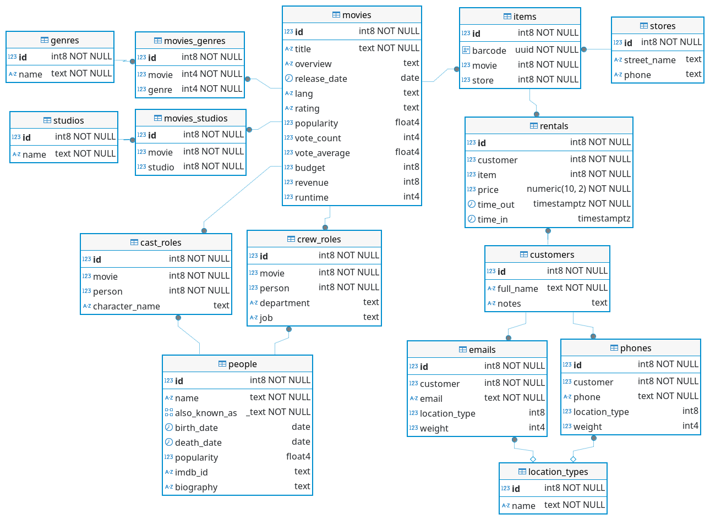

# Movies Rentals sample data set

This is a sample data set for a hypothetical movie rental business with multiple stores and some metadata about their movie inventory.



It contains _real data_ in the `movies`, `genres`, `studios`, and `people` tables (and the join tables between them).

It contains fictional data in the `stores`, `items`, `rentals`, and `customers` tables.

There are about 8k movies, 200k items, and 1M rentals.

## Origin and attribution

This data set is a transformation of the [Bluebox](https://github.com/ryanbooz/bluebox) data set from Ryan Booz. Bluebox builds off of the [Paglia](https://github.com/devrimgunduz/pagila) data set and incorporates real movie data from [TMDB](https://www.themoviedb.org/).

## How to load this data into Mathesar

1. Get the `movie_rentals.sql.zip` file by cloning this repo or downloading the file.

1. (Optionally) create a `movies` database.

    ```
    docker exec -i mathesar_dev_db psql \
      -U mathesar \
      -d postgres \
      -c 'CREATE DATABASE movies;'
    ```

1. Load the data.

    ```
    unzip -p movie_rentals.sql.zip | docker exec -i mathesar_dev_db bash -c 'psql -U mathesar -d movies'
    ```

    This will create a `movie_rentals` schema to hold the data. If that schema already exists, it will fail.

## How to rebuild this data set

These steps: start a Postgres container, load the Bluebox data committed here, apply our ETL, and regenerate the `movie_rentals.sql.zip` file committed here.

1. Stop your Mathesar development environment if it's running. Use `docker ps` to ensure that `mathesar-dev-db` is _not_ running.

    _(This is to free up port 5432 on your host machine)._

1. cd into to this `movie_rentals` directory.

1. Start an ephemeral `postgis` Docker container and setup a database named `bluebox` with the postgis extension.

    _(This is because the bluebox data set has geospatial data so we need postgis in order to work with it.)_

    ```
    docker run --rm \
      --name postgis \
      -e POSTGRES_USER=postgres \
      -e POSTGRES_PASSWORD=postgres \
      -e POSTGRES_DB=bluebox \
      -p 5432:5432 \
      postgis/postgis:15-3.5
    ```

    Wait until you see it print:

    > database system is ready to accept connections

    Now leave this running and use another terminal for the remaining tasks (also from the `movie_rentals` directory).

1. Load the bluebox data set into the database created in the last step.

    ```
    unzip -p bluebox/bluebox_v0.3.sql.zip \
      | docker exec -i postgis psql -U postgres -d bluebox
    ```

    Now you can use a tool like DBeaver to inspect the bluebox data set if you like.

1. Run the transformation.

    ```
    cat etl.sql | docker exec -i postgis psql --single-transaction -U postgres -d bluebox
    ```

1. Export the results

    ```
    docker exec \
      -i postgis pg_dump \
      -U postgres \
      -d bluebox \
      -n movie_rentals \
      --no-owner \
      --no-acl \
      | zip > movie_rentals.sql.zip
    ```

1. Commit changes to `movie_rentals.sql.zip`

1. In your other terminal window, shut down the postgis container with <kbd>Ctrl</kbd>+<kbd>C</kbd>. This will remove the container and all its data.


